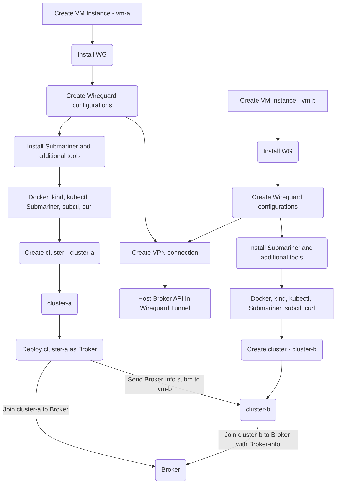

# Multi-Cloud-Support
Repository for Multi-Cloud Support sub group
## Visualization
#### WireGuard & Submariner workflow

```mermaid
flowchart TD
    A[Create VM Instance - vm-a] 
    --> B(Install WG)
    --> C(Create Wireguard configurations)
    --> D(Install Submariner and additional tools)
    --> E[Docker, kind, kubectl, Submariner, subctl, curl]
    --> F(Create cluster - cluster-a)
    --> G(cluster-a)
    --> H(Deploy cluster-a as Broker)
    

    H--> |Join cluster-a to Broker|I
    H--> |Send Broker-info.subm to vm-b|GG
    GG--> |Join cluster-b to Broker with Broker-info|I
    C --> AB[Create VPN connection]
    CC --> AB
    --> G2(Host Broker API in Wireguard Tunnel)
 

    I(Broker)

    AA[Create VM Instance - vm-b]
    --> BB(Install WG)
    --> CC(Create Wireguard configurations)
     --> DD(Install Submariner and additional tools)
     --> EE[Docker, kind, kubectl, Submariner, subctl, curl]
     --> FF(Create cluster - cluster-b)
     --> GG(cluster-b)
```
    
    

